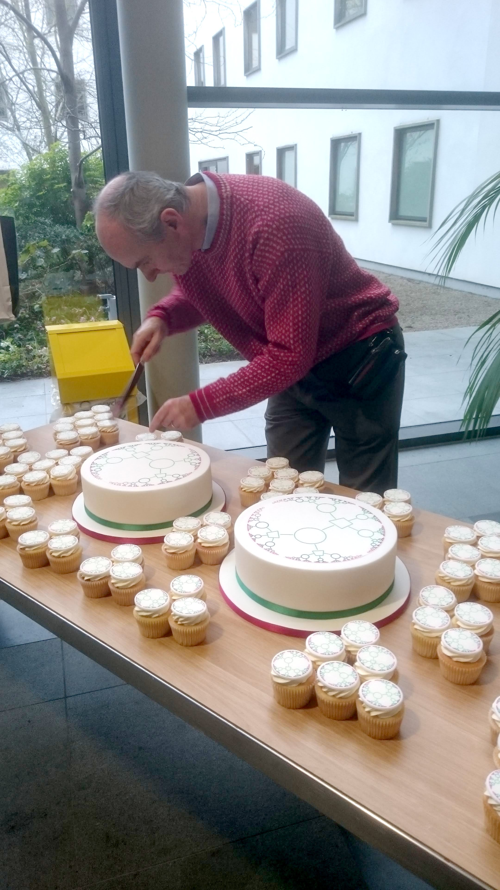
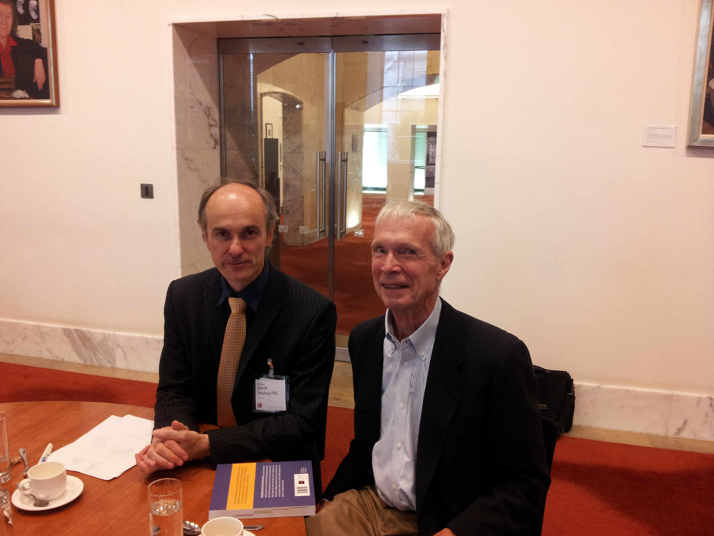

\clearpage

# The Inference Group

David’s work in information theory was driven by a simple, powerful framing: communication and learning are both problems of inference under uncertainty, and the right mathematics should lead to algorithms that are not just elegant but useful.

Trained in this probabilistic viewpoint during his PhD in John Hopfield’s group at Caltech, he returned to Cambridge and at the Cavendish Laboratory built what became his “inference lab” in practice — the Inference Group - where ideas from Bayesian modelling, graphical models, and coding theory were developed side-by-side.

He also spent time in the wider London–Cambridge machine-learning ecosystem, including work at UCL’s Gatsby Computational Neuroscience Unit (led by Geoffrey Hinton in its early years), keeping his information-theoretic instincts closely connected to the frontier of neural computation.

The world-level effect of this body of work is everywhere but rarely named: the error-correcting and probabilistic decoding ideas he advanced underpin the reliability of modern digital communication and storage, and the same “inference-first” mindset now saturates machine learning—making systems that cope gracefully with noise, ambiguity, and partial information.

{ width=100% }

{ width=100% }

\newpage
