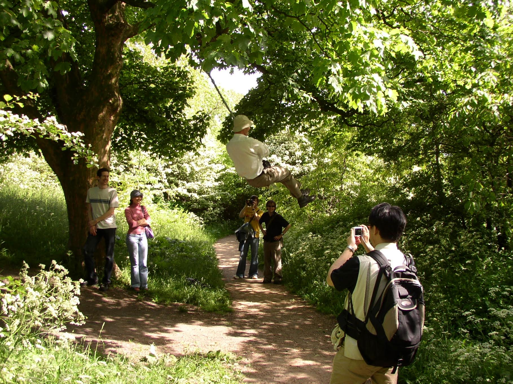

\clearpage

# Inspiration
Why have so many people chosen to bear witness to David's life and contributions? As these tributes make clear, David was not just a great thinker, but also an inspiration to many. In the way he lived and interacted with the world, there's a sense of what the Greeks called ἀγάπη - the selfless, unconditional love of universal compassion. This final section illuminates David's goodwill to the universe and how it has inspired others to behave likewise.

{ width=100% }

\newpage
